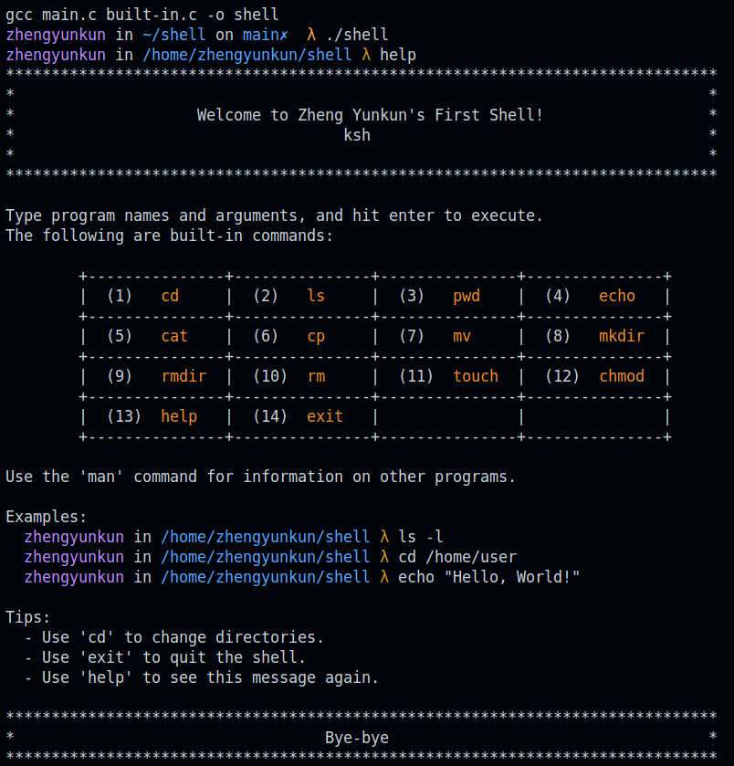

# A Simple Shell in C

## Install the shell

```bash
cd /shell
make
```

### Use the shell

```bash
./shell
```

### Enter the shell like



### Clean the shell

```bash
make clean
```

### More updates will follow